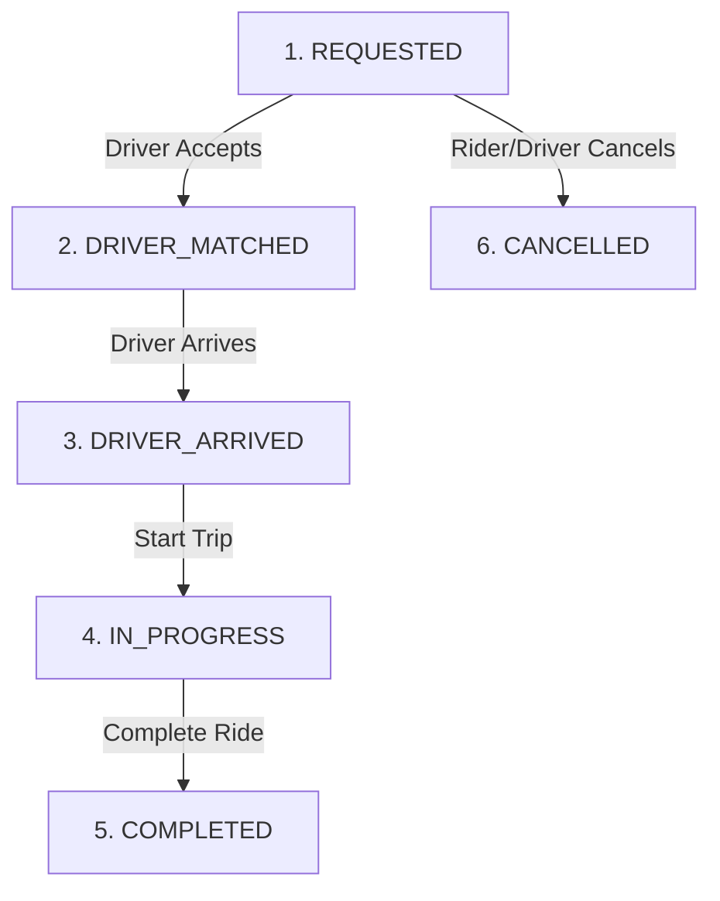
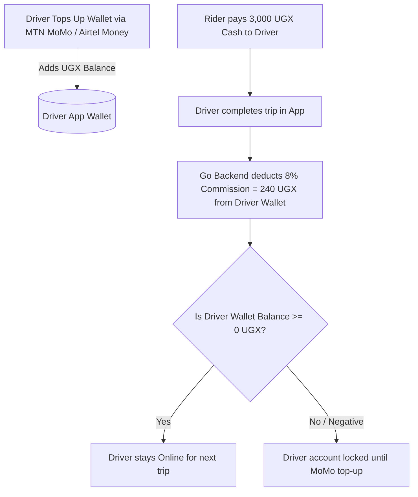

# 📘 SYSTEM BIBLE: Ugandan Cash-First Ride-Sharing Platform

A production-ready architectural blueprint, domain model specification, and technical system bible for an ultra-low-latency, cash-native ride-sharing platform optimized for the Ugandan market (Kampala & regional hubs), benchmarked directly against real SafeBoda and FARAS trip data.

---

## 🎯 Executive Overview & Strategic Vision

### 1. Reverse-Engineered Competitor Benchmark (SafeBoda vs. FARAS vs. Us)
Based on live telemetry & receipts on the exact same **4.2 km route** (Ripple Effect Uganda ➔ Komamboga, Kampala):

| Feature / Metric | SafeBoda (Receipt Data) | FARAS (Receipt Data) 🏆 | Our Platform Target 🎯 |
| :--- | :--- | :--- | :--- |
| **Standard 4.2km Fare** | `UGX 3,600` – `UGX 3,900` | **`UGX 3,000`** (Flat rate) | **`UGX 2,800` – `UGX 3,000`** |
| **Promo Fare** | None | **`UGX 2,500`** (-500 Promo) | **`UGX 2,500`** (-500 Promo) |
| **Pricing Model** | Complex sub-items + `1,009 UGX` Long Ride Penalty | Clean 500 / 1,000 UGX step pricing | Clean 500 / 1,000 UGX step pricing |
| **Driver Commission** | **15%** (Driver gets `3,060` of 3,600) | **15%** (Driver gets `2,550` of 3,000) | **8%** (Driver gets `2,760` of 3,000) |
| **Driver Net Payout** | `3,060 UGX` | `2,550 UGX` | **`2,760 UGX` (+210 UGX more than FARAS!)** |
| **Referral Engine** | Standard | `1,500 UGX` Referrer / `5,000 UGX` Friend | `1,500 UGX` Referrer / `3,000 UGX` Friend |

---

### 2. Key Insights Discovered from Live Market Data

#### 💡 Insight A: FARAS is Beating SafeBoda on Flat, Clean Pricing
* SafeBoda charges **`3,600 – 3,900 UGX`** for 4.2km due to complex line items and hidden long-ride surcharges.
* FARAS charges a flat, clean **`3,000.00 UGX`** (and **`2,500 UGX`** during promotions), making FARAS **17% to 36% cheaper** than SafeBoda!

#### 💡 Insight B: How We Beat BOTH Competitors Simultaneously
By charging **`3,000 UGX`** (matching FARAS for riders) but taking only **8% commission**:
* **FARAS Driver** earns `2,550 UGX` on a 3,000 UGX ride.
* **Our Driver** earns **`2,760 UGX`** on the exact same 3,000 UGX ride!
* **Result**: Riders get the cheapest market price (`3,000 UGX`), while drivers earn **+210 UGX more per ride** on our platform!

---

## 🏗️ System Architecture & Technology Stack

```text
[ Rider / Driver Mobile Apps ]
        │
        ├── (HTTP / JSON REST) ──────────► [ Chi Router / Go Backend ]
        └── (WebSockets / Realtime GPS) ──► [ Gorilla WebSockets ]
                                                   │
                                     ┌─────────────┴─────────────┐
                                     ▼                           ▼
                           [ Redis (GEO Cache) ]       [ PostgreSQL + PostGIS ]
                           (Live Driver GPS Tracking)   (ACID Trips & Wallets)
```

| Layer | Technology | Purpose & Rationale |
| :--- | :--- | :--- |
| **Language** | **Go 1.25** | Sub-millisecond latency, concurrency (`goroutines`), <10 MB RAM footprint. |
| **HTTP Router** | **`Chi` (`go-chi/chi/v5`)** | 100% `net/http` compatible, zero allocations, clean middleware groups (`r.Group(...)`). |
| **Database & ORM** | **PostgreSQL + PostGIS + `sqlc`** | Spatial queries (`ST_DWithin`) with compile-time type-safe Go code generation. |
| **Realtime Cache** | **Redis (GEO Commands)** | Drivers stream GPS locations every 3s. `GEOADD` and `GEORADIUS` match drivers in <2ms. |
| **Mobile Money** | **MTN MoMo & Airtel Money** | Driver prepaid wallet top-ups via direct API integration or Flutterwave/Beyonic aggregators. |
| **Containerization** | **Multi-stage `scratch` Docker** | 5.7 MB static binary image, 0 OS CVEs, running under non-root `nobody` (UID 65534). |

---

## 📁 Package-by-Feature Project Structure

```text
ride-share-uganda/
├── cmd/
│   └── api/
│       └── main.go                 # App entrypoint: loads config, boots DB, runs Chi server
├── internal/                       # Compiler-enforced private application code
│   ├── config/
│   │   └── config.go               # Environment parser (PORT, DATABASE_URL, MOMO_KEYS)
│   ├── db/
│   │   ├── migrations/             # Sequential Goose PostGIS SQL migration files
│   │   │   ├── 00001_create_users_table.sql
│   │   │   ├── 00002_create_postgis_trips.sql
│   │   │   ├── 00003_create_wallets_table.sql
│   │   │   └── 00004_create_promotions_table.sql
│   │   ├── queries/                # Raw SQL query definitions for sqlc
│   │   │   ├── users.sql
│   │   │   ├── trips.sql
│   │   │   ├── wallets.sql
│   │   │   └── promos.sql
│   │   └── db.go                   # PostGIS connection pool & migration runner
│   ├── location/                   # Real-time WebSocket GPS streaming & Redis GEO index
│   │   ├── handler.go              # WS handler (/ws/driver/location)
│   │   └── redis_geo.go            # GEOADD / GEORADIUS query engine
│   ├── trip/                       # Trip State Machine & Driver Matchmaker
│   │   ├── handler.go              # REST trip endpoints (/api/trips/request)
│   │   ├── service.go              # Dispatch logic to nearest driver
│   │   └── state.go                # Trip State Machine logic
│   ├── pricing/                    # Reverse-engineered SafeBoda & FARAS pricing engine
│   │   └── uganda.go
│   ├── promo/                      # Referral & Discount Promo Engine (1,500 UGX referral)
│   │   └── service.go
│   ├── wallet/                     # MTN MoMo & Airtel Money driver wallet top-ups
│   │   ├── service.go
│   │   └── momo.go                 # MoMo API integration
│   ├── logger/                     # Scale-ready structured JSON logging (log/slog)
│   │   └── logger.go
│   ├── middleware/
│   │   └── auth.go                 # Session token & Bearer auth middleware
│   └── models/
│       └── models.go               # Shared domain structs & API response envelopes
├── deploy/
│   └── terraform/
│       └── main.tf                 # Production Infrastructure-as-Code blueprint
├── Caddyfile                       # Auto-HTTPS & Cloudflare proxy configuration
├── docker-compose.prod.yml         # Production multi-container Docker Compose
├── .env                            # Active local environment config
├── .env.example                    # Environment variable template
├── Dockerfile                      # Active production Dockerfile (scratch base)
├── Makefile                        # Dev automation (make run, make test, make generate)
├── sqlc.yaml                       # sqlc code generator manifest
├── go.mod                          # Go module definition
└── README.md                       # High-level overview
```

---

## 💰 Ugandan Market Pricing Engine (`internal/pricing/uganda.go`)

### Go Code Implementation:

```go
package pricing

import (
	"math"
)

type MarketRates struct {
	BaseFare       float64 // 1,000 UGX
	PerKmRate      float64 // 450 UGX / km
	PerMinuteRate  float64 // 30 UGX / min
	MinimumFare    float64 // 2,000 UGX
	CommissionPct  float64 // 0.08 (8% vs 15% SafeBoda/FARAS)
}

type TripPricingBreakdown struct {
	BaseFare       int64 `json:"base_fare"`
	DistanceCost   int64 `json:"distance_cost"`
	DurationCost   int64 `json:"duration_cost"`
	PromoDiscount  int64 `json:"promo_discount_ugx"`
	Subtotal       int64 `json:"subtotal"`
	FinalCostUGX   int64 `json:"final_cost_ugx"`
	DriverEarnings int64 `json:"driver_earnings_ugx"`
	PlatformFee    int64 `json:"platform_fee_ugx"`
}

// CalculateUgandaFare calculates competitive clean fares with 500 UGX rounding
func CalculateUgandaFare(distanceKm, durationMins, promoDiscount float64, rates MarketRates) TripPricingBreakdown {
	distCost := distanceKm * rates.PerKmRate
	durCost := durationMins * rates.PerMinuteRate
	rawSubtotal := rates.BaseFare + distCost + durCost

	if rawSubtotal < rates.MinimumFare {
		rawSubtotal = rates.MinimumFare
	}

	// Clean 500 UGX Step Rounding (e.g. 2,850 -> 3,000 UGX)
	subtotalRounded := int64(math.Round(rawSubtotal/500.0) * 500.0)

	finalCost := subtotalRounded - int64(promoDiscount)
	if finalCost < 1000 {
		finalCost = 1000
	}

	// Ultra-low 8% Commission
	platformFee := int64(float64(finalCost) * rates.CommissionPct)
	driverEarnings := finalCost - platformFee

	return TripPricingBreakdown{
		BaseFare:       int64(rates.BaseFare),
		DistanceCost:   int64(distCost),
		DurationCost:   int64(durCost),
		PromoDiscount:  int64(promoDiscount),
		Subtotal:       subtotalRounded,
		FinalCostUGX:   finalCost,
		DriverEarnings: driverEarnings,
		PlatformFee:    platformFee,
	}
}
```

---

## ⚡️ End-to-End Operational Workflow

### Step 1: Rider Requests a Ride (Upfront Low Price)
1. Rider inputs pickup (**Semawata Rd**) and dropoff (**Komamboga**).
2. Go Pricing Engine computes distance (`4.2km`), duration (`11 mins`), and calculates upfront fare (**`3,000 UGX`** or **`2,500 UGX`** with promo).
3. Rider sees: **"Upfront Cash Fare: 3,000 UGX"** and taps Request.

### Step 2: Instant Driver Matching (Redis GEO <2ms)
1. Go backend executes Redis query: `GEORADIUS drivers:available <pickup_lng> <pickup_lat> 3 km`.
2. Finds closest driver (e.g., Timothy on his Boda 500m away).
3. Sends WebSocket notification to driver: *"New Trip: Semawata Rd ➔ Komamboga (Fare: 3,000 UGX, Net: 2,760 UGX)"*.

### Step 3: Realtime GPS Streaming (WebSockets)
1. Driver accepts. Trip state becomes `DRIVER_MATCHED`.
2. Driver phone sends GPS updates every 3s over WebSockets to update live map.
3. Driver arrives ➔ Taps **"Arrived"** (`DRIVER_ARRIVED`).

### Step 4: Dropoff & Cash Payment (Digital Change Wallet)
1. Driver completes trip (`COMPLETED`). Screen displays: **"Pay Driver: 3,000 UGX Cash"**.
2. Rider pays `5,000 UGX` note. Driver returns `2,000 UGX` note.
3. *(If driver lacks 500 UGX change, driver taps "Credit 500 UGX Change", which credits 500 UGX to rider's app wallet for their next trip).*

### Step 5: Automated 8% Commission Settlement
1. Driver taps **"Confirm Cash Received (3,000 UGX)"**.
2. Go backend automatically deducts 8% commission (**`240 UGX`**) from driver's prepaid MTN/Airtel MoMo wallet.
3. Driver keeps **`2,760 UGX` net cash profit** (+210 UGX more than FARAS) and returns `ONLINE`.

---

## 🚀 Scale Readiness & Infrastructure Engineering (8 Pillars)

| Pillar | Mechanism | Architectural Rationale |
| :--- | :--- | :--- |
| **1. Dual Health Probes** | `/healthz` & `/readyz` | Liveness (`/healthz`) checks if process is running; Readiness (`/readyz`) pings DB to prevent sending traffic to broken instances. |
| **2. Structured JSON Logging** | `log/slog` | Emits structured JSON logs to `stdout` for instant searching across 50+ nodes in Loki / Grafana. |
| **3. Database Safety** | `SetMaxOpenConns` + `pgBouncer` | Limits Go DB pools (`25`) and uses `pgBouncer` so 10,000+ goroutines never overwhelm PostgreSQL. |
| **4. Rate Limiting** | Redis Token Bucket | Caps users/IPs at 60 req/min across distributed servers using Redis middleware. |
| **5. Idempotency Keys** | `Idempotency-Key` Header | Prevents duplicate MoMo wallet deductions or payments if 3G/4G network drops mid-request. |
| **6. Async Background Workers** | `Asynq` + Redis | Offloads SMS OTP sending and Push Notifications to background workers, keeping API responses sub-10ms. |
| **7. Graceful Draining** | 15s `SIGTERM` Drain | Waits 15 seconds during shutdown to complete active WebSocket & HTTP requests cleanly. |
| **8. Zero-Downtime DB Migrations** | Backward Compatible SQL | Never drops active columns in production; always adds new columns first, deploys code, then cleans up. |

---

## ☁️ Production Cloud Deployment Architecture & Provider Matrix

### 1. Cloud Provider Matrix

| Provider | Cost / Month | Setup Complexity | Latency to Uganda | Verdict |
| :--- | :---: | :---: | :---: | :--- |
| **DigitalOcean** | **`$12 – $24 / mo`** | 🟢 Easy | ⚡️ Low (~120ms Frankfurt) | **🏆 BEST FOR LAUNCH** |
| **Hetzner Cloud** | **`$5 – $12 / mo`** | 🟢 Easy | ⚡️ Low (~130ms Germany) | **🏆 BEST ULTRA-LOW COST** |
| **Cloudflare** | **`$0 / mo` (Free)** | 🟢 Easy | 🌍 Global Edge | **🛡️ MANDATORY FRONT LAYER** |
| **AWS (EC2/RDS)** | **`$80 – $200 / mo`** | 🔴 Complex | 🟡 Medium (~90ms Cape Town) | ⚠️ Overkill for Day 1 |
| **GCP (Cloud Run)**| **`$10 – $50 / mo`** | 🟡 Moderate | 🟡 Medium | ⏸️ Reserve for Phase 2 |

### 2. Hybrid Production Architecture

```text
[ Mobile App Clients in Kampala ]
               │
               ▼
   [ 🛡️ Cloudflare (FREE) ] ──► DNS, Auto-SSL, Anti-DDoS Shield, WAF
               │
               ▼
   [ 🖥️ DigitalOcean Droplet ($12/mo) ]
   - Caddy Web Server (Reverse Proxy)
   - Go Scratch Docker Container (5.7 MB static binary)
   - PostgreSQL 16 + PostGIS Docker
   - Redis 7 Docker (Spatial GEO Index)
```

### 3. Step-by-Step Production Deployment Guide

**Step 1: Provision Infrastructure (Terraform)**
Run Terraform to create the Droplet, Managed Postgres, Managed Redis, and configure Cloudflare DNS.
```bash
cd deploy/terraform
terraform init
terraform apply
```
*Note the output values for `server_ip`, `postgres_uri`, and `redis_uri`.*

**Step 2: Configure GitHub Secrets for CI/CD**
To allow GitHub Actions to automatically deploy your code and configure your databases, add these 5 secrets to your repository (Settings > Secrets and variables > Actions):
- `VPS_HOST`: The `server_ip` from Terraform
- `VPS_USER`: `root` (or your Droplet username)
- `VPS_SSH_KEY`: The contents of your private SSH key (`~/.ssh/id_rsa`)
- `DATABASE_URL`: The `postgres_uri` from Terraform (e.g., `postgresql://...`)
- `REDIS_URL`: The `redis_uri` from Terraform (e.g., `redis://...`)

**Step 3: Push to Deploy!**
Commit your code and push to the `main` branch. 
GitHub Actions will automatically:
1. Build the Go binary and push it to GHCR.
2. SSH into your Droplet.
3. Automatically generate the secure `.env` file using your GitHub Secrets.
4. Launch the application.

You are live with zero manual server configuration!

### 4. Infrastructure Scaling Management Matrix (Terraform IaC)

| Growth Stage | Traffic Volume | Terraform IaC Change | Execution Command | Time to Scale |
| :--- | :--- | :--- | :--- | :--- |
| **Stage 1: Vertical Upgrade** | 0 – 10,000 Drivers | Update `size = "s-4vcpu-8gb"` in `main.tf` | `terraform apply` | **< 90 seconds** |
| **Stage 2: Horizontal Load Balancer** | 10,000 – 50,000 Drivers | Add `count = 3` + `digitalocean_loadbalancer` in `main.tf` | `terraform apply` | **< 3 minutes** |
| **Stage 3: Managed High-Availability DB** | 50,000+ Drivers | Add `digitalocean_database_cluster` in `main.tf` | `terraform apply` | **< 5 minutes** |

---

## 📊 Monitoring, Observability & Alerting Strategy

A production application that you cannot observe is an application you cannot trust. This section defines the three-phase monitoring roadmap, from zero-cost pre-launch to enterprise-grade APM.

### 1. Tool Comparison: Datadog vs. Grafana

| Dimension | Grafana + Prometheus (OSS) | Datadog (SaaS) |
| :--- | :--- | :--- |
| **Cost** | **Free** (just the Droplet, ~$6/mo) | **$15+/server/month + log volume fees** |
| **Setup Time** | 1–2 days to wire Prometheus + Loki + Grafana | **~10 minutes** (install agent, done) |
| **Dashboard Quality** | 🏆 World-class custom dashboards (TV-screen maps of rides in Kampala) | Good, but less flexible |
| **APM (Code-level tracing)** | Basic | 🏆 Industry best. Traces exact slow DB queries per request |
| **Log Aggregation** | Via Loki (self-managed) | 🏆 Built-in, instant search |
| **AI Anomaly Alerts** | Manual threshold rules | 🏆 ML-powered (learns your traffic patterns) |
| **Best For** | Bootstrapped startups, cost control | Funded teams, rapid debugging |

### 2. Three-Phase Monitoring Rollout

| Phase | When | Tooling | Cost |
| :--- | :--- | :--- | :--- |
| **Phase 1: Pre-Launch** | Day 1 (Now) | DigitalOcean CPU/RAM Alerts (Terraform `digitalocean_monitor_alert`) + Go structured JSON logs | **$0/mo** |
| **Phase 2: Growing** | 1,000+ rides/day | Grafana + Prometheus on a dedicated $6/mo Droplet. Scrape Go `/metrics` endpoint. Loki for log search | **$6/mo** |
| **Phase 3: Scaled** | Raised funding / 50,000+ drivers | Datadog. Install agent on all Droplets. Full APM, distributed tracing, AI anomaly detection | **$50–$200/mo** |

### 3. Phase 2 Architecture (Grafana Stack)

The Grafana stack uses a 3-tool chain. Each tool has one job:

```text
[ Go App on Droplet A ]
        │
        │  (Exposes /metrics endpoint via Prometheus Go library)
        │
        ▼
[ Prometheus on Droplet B ]  ──►  Scrapes /metrics every 5s, stores time-series data
        │
        ▼
[ Grafana on Droplet B ]     ──►  Reads from Prometheus, renders beautiful dashboards
        │
        ▼
[ Loki on Droplet B ]        ──►  Aggregates all Go stdout JSON logs for search
```

**Go Code Change Required:** Install `github.com/prometheus/client_golang` and expose one new route:
```go
import "github.com/prometheus/client_golang/prometheus/promhttp"

// Add to Chi router:
r.Handle("/metrics", promhttp.Handler())
```

**Caddy Security:** Route `dashboard.yourrideshare.ug` through Caddy with basic auth so Grafana is never publicly accessible.

### 4. Key Metrics to Monitor

| Metric | Source | Critical Threshold | Alert Action |
| :--- | :--- | :--- | :--- |
| **API Server CPU** | DigitalOcean (via Terraform alert) | > 80% for 5 min | Scale Droplet vertically |
| **HTTP Request Rate** | Prometheus Go library | Drop > 50% in 5 min | Investigate app crash |
| **P99 Response Time** | Prometheus Go library | > 500ms | Investigate slow DB queries |
| **Postgres Connections** | Prometheus Postgres Exporter | > 80% of `max_connections` | Add `pgBouncer` pooling |
| **Redis Memory Used** | Prometheus Redis Exporter | > 80% RAM | Upgrade Redis cluster size |
| **Failed Trip Bookings** | Custom business metric in Go | > 5% error rate | Page on-call engineer |

---

## 🚀 Go-To-Market (GTM) & Growth Playbook

### 1. Boda Stage Chairman Strategy
- Target physical Boda stages (Acacia, Wandegeya, MUBS Nakawa, Kampala Rd).
- Offer Stage Chairmen **`5,000 UGX` MoMo bonus** per active driver onboarded.
- Pitch drivers: *"Pay 8% Commission, Not 15%! Keep More Cash Every Ride"*.

### 2. Viral Referral Engine (`1,500 UGX`)
- *"Share code: Your friend gets `3,000 UGX` off 1st ride; you get `1,500 UGX` wallet credit!"*
- Append shareable links to all digital receipts sent via SMS & WhatsApp.

### 3. Reflective Jacket Street Branding
- Equip drivers with branded reflective jackets & helmets.
- Deduct jacket cost (`15,000 UGX`) in small **`500 UGX` daily wallet deductions** over 30 days.

---

## 💵 Financial Model & 3-Month Lean Launch Budget

| Expense Category | Item Description | Cost (USD) | Cost (UGX) |
| :--- | :--- | :--- | :--- |
| **1. Servers & Tech** | Hetzner / DigitalOcean $10/mo VPS (Go + Postgres + Redis) + Domain | `$45` | `165,000 UGX` |
| **2. SMS & MoMo API** | SMS OTP Verification (Africa's Talking) + MoMo API setup | `$90` | `335,000 UGX` |
| **3. Driver Branding** | 50 Branded Reflective Jackets & Helmets *(Recouped via daily 500 UGX deductions!)* | `$600` | `2,250,000 UGX` |
| **4. Boda Stage Incentives**| Chairmen bonuses (`5,000 UGX` / driver) + Driver initial wallet bonus | `$135` | `500,000 UGX` |
| **5. Rider Referral Promos**| First-ride discounts (`1,000 UGX` off 500 rides) + Student referral fund | `$200` | `750,000 UGX` |
| **6. Business Legal** | URSB Company Registration (Kampala) | `$40` | `150,000 UGX` |
| **TOTAL PILOT BUDGET** | **Minimal Bootstrapped Pilot (50 Drivers)** | **`~$1,110 USD`** | **`~4,150,000 UGX`** |

---

## 🎁 Referral & Promo Engine (`internal/promo/service.go`)

```sql
-- 00004_create_promotions_table.sql
CREATE TABLE IF NOT EXISTS referral_codes (
    id BIGSERIAL PRIMARY KEY,
    user_id BIGINT NOT NULL REFERENCES users(id),
    code VARCHAR(20) NOT NULL UNIQUE,
    created_at TIMESTAMPTZ DEFAULT CURRENT_TIMESTAMP
);

CREATE TABLE IF NOT EXISTS user_promos (
    id BIGSERIAL PRIMARY KEY,
    user_id BIGINT NOT NULL REFERENCES users(id),
    amount_ugx BIGINT NOT NULL DEFAULT 500,
    is_used BOOLEAN DEFAULT FALSE,
    expires_at TIMESTAMPTZ NOT NULL
);
```

---

## 🔄 Trip State Machine Specification



---

## 💳 Driver Mobile Money Wallet Architecture



---

## 🗺️ Hybrid Mapping Engine Architecture

To eliminate massive recurring map API fees while maintaining 100% search accuracy in Kampala, the platform implements a 3-part hybrid mapping stack:

```text
┌────────────────────────────────────────────────────────────────────────┐
│                        HYBRID MAPPING ENGINE                           │
├───────────────────┬──────────────────────────┬─────────────────────────┤
│ RESPONSIBILITY    │ PROVIDER / TOOL          │ OPERATIONAL COST        │
├───────────────────┼──────────────────────────┼─────────────────────────┤
│ 1. Mobile Map UI  │ Mapbox GL Native SDK     │ FREE (up to 50k MAUs)   │
│ 2. Routing & ETA  │ Self-Hosted OSRM (Docker)│ $0 / Unlimited Requests │
│ 3. Place Search   │ Google Places API        │ Minimal (~$20/month)    │
└───────────────────┴──────────────────────────┴─────────────────────────┘
```

### 1. Cost Comparison: Pure Google Maps vs. Hybrid Engine
* **Pure Google Maps API:** ~$5 per 1,000 directions + $10 per 1,000 distance matrix requests = **$1,500 – $3,000 / month**.
* **Hybrid Engine:** **~$20 – $30 / month** (99% cost reduction!).

### 2. OSRM Docker Setup (Zero-Cost Routing)
OSRM handles exact distance (`4.2 km`), duration (`11 mins`), and polyline rendering over OpenStreetMap data for Uganda:

```bash
# 1. Download OpenStreetMap extract for Uganda
wget https://download.geofabrik.de/africa/uganda-latest.osm.pbf

# 2. Process routing graph for Boda / Car profile
docker run -t -v $(pwd):/data osrm/osrm-backend osrm-extract -p /opt/car.lua /data/uganda-latest.osm.pbf
docker run -t -v $(pwd):/data osrm/osrm-backend osrm-contract /data/uganda-latest.osrm

# 3. Launch OSRM microservice
docker run -d -p 5000:5000 -v $(pwd):/data osrm/osrm-backend osrm-routed --algorithm mld /data/uganda-latest.osrm
```

---

## 🌐 Multi-Country Expansion Architecture

The platform architecture is built to be 100% country-agnostic. Expanding to a new country (e.g. Kenya 🇰🇪, Rwanda 🇷🇼, Tanzania 🇹🇿, Nigeria 🇳🇬) requires **zero code rewrites**, only config parameter adjustments.

### 1. Country Configuration Matrix

| Country | Code | Currency | Default Step Rounding | Mobile Payment Gateway | OSRM Map Extract |
| :--- | :--- | :--- | :--- | :--- | :--- |
| **Uganda 🇺🇬** | `UG` | `UGX` | `500 UGX` | MTN MoMo / Airtel Money | `uganda-latest.osm.pbf` |
| **Kenya 🇰🇪** | `KE` | `KES` | `10 KES` | Safaricom M-PESA (Daraja API) | `kenya-latest.osm.pbf` |
| **Rwanda 🇷🇼** | `RW` | `RWF` | `100 RWF` | MTN Mobile Money Rwanda | `rwanda-latest.osm.pbf` |
| **Tanzania 🇹🇿** | `TZ` | `TZS` | `500 TZS` | Vodacom M-Pesa / Tigo Pesa | `tanzania-latest.osm.pbf` |
| **Nigeria 🇳🇬** | `NG` | `NGN` | `100 NGN` | Paystack / Flutterwave | `nigeria-latest.osm.pbf` |

### 2. Pluggable Payment Provider Interface (Go)

```go
type PaymentProvider interface {
    TopUpWallet(ctx context.Context, phoneNumber string, amount int64) (*PaymentResponse, error)
    DisburseEarnings(ctx context.Context, phoneNumber string, amount int64) (*PaymentResponse, error)
}
```

By adhering to this interface, switching or adding new country payment integrations (e.g. M-PESA for Kenya or Paystack for Nigeria) is isolated to a single package implementation.

