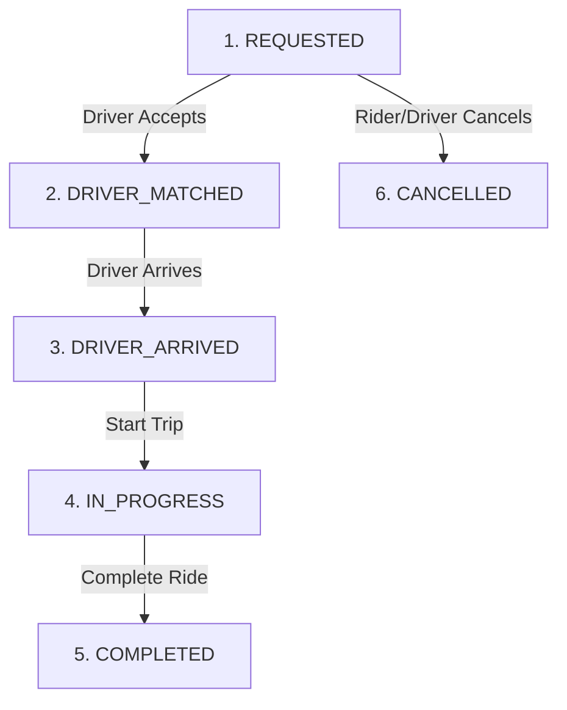

# 📘 SYSTEM BIBLE: Ugandan Cash-First Ride-Sharing Platform

A production-ready architectural blueprint, domain model specification, and technical system bible for a ultra-low-latency, cash-native ride-sharing platform optimized for the Ugandan market (Kampala & regional hubs).

---

## 🎯 Executive Overview & Strategic Vision

### 1. The Market Opportunity (Uganda)
Competitors in Uganda (Uber, Bolt, SafeBoda) face critical operational friction:
* **High Commission Friction**: Competitors charge 15% – 25% commission, driving away quality drivers.
* **Cash & Change Shortage**: 90%+ of transactions are cash, but 500 UGX coins are scarce, creating constant friction over change.
* **High Rider Pricing**: High minimum fares discourage short urban trips.

### 2. The Core Value Proposition
* **For Drivers**: Ultra-low **8% platform commission** (drivers keep **92%** of every fare vs. 75% on competitors).
* **For Riders**: Budget-friendly **2,000 UGX minimum fare** with 500 UGX price increments.
* **For Cash Change**: Integrated **Digital Change Wallet** allowing drivers to instantly credit unreturned 500 UGX change to the rider's in-app wallet for their next trip.

---

## 🏗️ System Architecture & Technology Stack

```text
[ Rider / Driver Mobile Apps ]
        │
        ├── (HTTP / JSON REST) ──────────► [ Chi Router / Go Backend ]
        └── (WebSockets / Realtime GPS) ──► [ Gorilla WebSockets ]
                                                   │
                                     ┌─────────────┴─────────────┐
                                     ▼                           ▼
                           [ Redis (GEO Cache) ]       [ PostgreSQL + PostGIS ]
                           (Live Driver GPS Tracking)   (ACID Trips & Wallets)
```

| Layer | Technology | Purpose & Rationale |
| :--- | :--- | :--- |
| **Language** | **Go 1.25** | Sub-millisecond latency, concurrency (`goroutines`), <10 MB RAM footprint. |
| **HTTP Router** | **`Chi` (`go-chi/chi/v5`)** | 100% `net/http` compatible, zero allocations, clean middleware groups (`r.Group(...)`). |
| **Database & ORM** | **PostgreSQL + PostGIS + `sqlc`** | Spatial queries (`ST_DWithin`) with compile-time type-safe Go code generation. |
| **Realtime Cache** | **Redis (GEO Commands)** | Drivers stream GPS locations every 3s. `GEOADD` and `GEORADIUS` match drivers in <2ms. |
| **Mobile Money** | **MTN MoMo & Airtel Money** | Driver prepaid wallet top-ups via direct API integration or Flutterwave/Beyonic aggregators. |
| **Containerization** | **Multi-stage `scratch` Docker** | 5.7 MB static binary image, 0 OS CVEs, running under non-root `nobody` (UID 65534). |

---

## 📁 Package-by-Feature Project Structure

```text
ride-share-uganda/
├── cmd/
│   └── api/
│       └── main.go                 # App entrypoint: loads config, boots DB, runs Chi server
├── internal/                       # Compiler-enforced private application code
│   ├── config/
│   │   └── config.go               # Environment parser (PORT, DATABASE_URL, MOMO_KEYS)
│   ├── db/
│   │   ├── migrations/             # Sequential Goose PostGIS SQL migration files
│   │   │   ├── 00001_create_users_table.sql
│   │   │   ├── 00002_create_postgis_trips.sql
│   │   │   └── 00003_create_wallets_table.sql
│   │   ├── queries/                # Raw SQL query definitions for sqlc
│   │   │   ├── users.sql
│   │   │   ├── trips.sql
│   │   │   └── wallets.sql
│   │   └── db.go                   # PostGIS connection pool & migration runner
│   ├── location/                   # Real-time WebSocket GPS streaming & Redis GEO index
│   │   ├── handler.go              # WS handler (/ws/driver/location)
│   │   └── redis_geo.go            # GEOADD / GEORADIUS query engine
│   ├── trip/                       # Trip State Machine & Driver Matchmaker
│   │   ├── handler.go              # REST trip endpoints (/api/trips/request)
│   │   ├── service.go              # Dispatch logic to nearest driver
│   │   └── state.go                # Trip State Machine logic
│   ├── pricing/                    # UGX budget pricing engine & 500 UGX rounding logic
│   │   └── uganda.go
│   ├── wallet/                     # MTN MoMo & Airtel Money driver wallet top-ups
│   │   ├── service.go
│   │   └── momo.go                 # MoMo API integration
│   ├── middleware/
│   │   └── auth.go                 # Session token & Bearer auth middleware
│   └── models/
│       └── models.go               # Shared domain structs & API response envelopes
├── .env                            # Active local environment config
├── .env.example                    # Environment variable template
├── Dockerfile                      # Active production Dockerfile (scratch base)
├── Makefile                        # Dev automation (make run, make test, make generate)
├── sqlc.yaml                       # sqlc code generator manifest
├── go.mod                          # Go module definition
└── README.md                       # High-level overview
```

---

## 💰 Ugandan Pricing & Digital Change Engine

### 1. Budget Pricing Rules (UGX)
* **Base Fare**: `1,000 UGX`
* **Per-Km Rate**: `500 UGX / km`
* **Per-Minute Rate**: `50 UGX / min`
* **Minimum Fare**: `2,000 UGX`
* **Platform Commission**: **`8%`** (Driver keeps **92%**)

### 2. UGX Rounding & Change Logic
To avoid change disputes while keeping fares cheap:
- Fares are rounded to the nearest **500 UGX** (e.g., `2,150 UGX` ➔ `2,000 UGX`; `2,350 UGX` ➔ `2,500 UGX`).
- If a rider pays a `5,000 UGX` note for a `3,500 UGX` trip and the driver lacks 500 UGX change, the driver taps **"Credit 500 UGX Change"** in the app.
- The 500 UGX is credited to the **Rider App Wallet** for their next trip, and deducted from the driver's wallet.

---

## 🔄 Trip State Machine Specification



### State Rules:
1. **`REQUESTED`**: Rider submits pickup & dropoff coordinates. Redis GEORADIUS finds top 5 nearest drivers within 3km.
2. **`DRIVER_MATCHED`**: First driver to accept locks the trip.
3. **`COMPLETED`**: Driver confirms cash payment received. Backend automatically deducts 8% commission from driver wallet.

---

## 💳 Driver Mobile Money Wallet Architecture

Because riders pay 100% cash directly to drivers, the platform collects its 8% commission via a **Prepaid Driver Wallet**:


---

## 🗄️ Database Schema Specification (`internal/db/migrations/`)

```sql
-- 00001_create_users.sql
CREATE TABLE IF NOT EXISTS users (
    id BIGSERIAL PRIMARY KEY,
    phone_number VARCHAR(20) NOT NULL UNIQUE, -- Primary login in Uganda
    username VARCHAR(50) NOT NULL,
    email VARCHAR(255),
    role VARCHAR(20) NOT NULL DEFAULT 'RIDER', -- 'RIDER', 'DRIVER'
    created_at TIMESTAMPTZ DEFAULT CURRENT_TIMESTAMP
);

-- 00002_create_postgis_trips.sql
CREATE EXTENSION IF NOT EXISTS postgis;

CREATE TABLE IF NOT EXISTS trips (
    id BIGSERIAL PRIMARY KEY,
    rider_id BIGINT NOT NULL REFERENCES users(id),
    driver_id BIGINT REFERENCES users(id),
    status VARCHAR(30) NOT NULL DEFAULT 'REQUESTED',
    pickup_address TEXT NOT NULL,
    dropoff_address TEXT NOT NULL,
    pickup_location GEOMETRY(Point, 4326) NOT NULL,
    dropoff_location GEOMETRY(Point, 4326) NOT NULL,
    distance_km NUMERIC(6, 2) NOT NULL,
    duration_mins NUMERIC(6, 2) NOT NULL,
    fare_ugx BIGINT NOT NULL,
    platform_commission_ugx BIGINT NOT NULL,
    driver_earnings_ugx BIGINT NOT NULL,
    created_at TIMESTAMPTZ DEFAULT CURRENT_TIMESTAMP
);

CREATE INDEX idx_trips_pickup ON trips USING GIST(pickup_location);
CREATE INDEX idx_trips_status ON trips(status);

-- 00003_create_wallets.sql
CREATE TABLE IF NOT EXISTS driver_wallets (
    driver_id BIGINT PRIMARY KEY REFERENCES users(id),
    balance_ugx BIGINT NOT NULL DEFAULT 0,
    is_active BOOLEAN DEFAULT TRUE,
    updated_at TIMESTAMPTZ DEFAULT CURRENT_TIMESTAMP
);

CREATE TABLE IF NOT EXISTS wallet_transactions (
    id BIGSERIAL PRIMARY KEY,
    driver_id BIGINT NOT NULL REFERENCES users(id),
    amount_ugx BIGINT NOT NULL, -- Positive for MoMo top-up, negative for commission
    type VARCHAR(40) NOT NULL,   -- 'MOMO_TOPUP', 'COMMISSION_DEDUCTION', 'CHANGE_CREDIT'
    momo_reference VARCHAR(100),
    created_at TIMESTAMPTZ DEFAULT CURRENT_TIMESTAMP
);
```

---

## ⚡️ Developer Command Reference (`Makefile`)

```makefile
.PHONY: build run dev test generate

build:
	export PATH=$$PATH:/usr/local/go/bin; go build -o bin/api ./cmd/api

run:
	export PATH=$$PATH:/usr/local/go/bin; go run ./cmd/api

test:
	export PATH=$$PATH:/usr/local/go/bin; go test -v ./...

generate:
	sqlc generate
```
