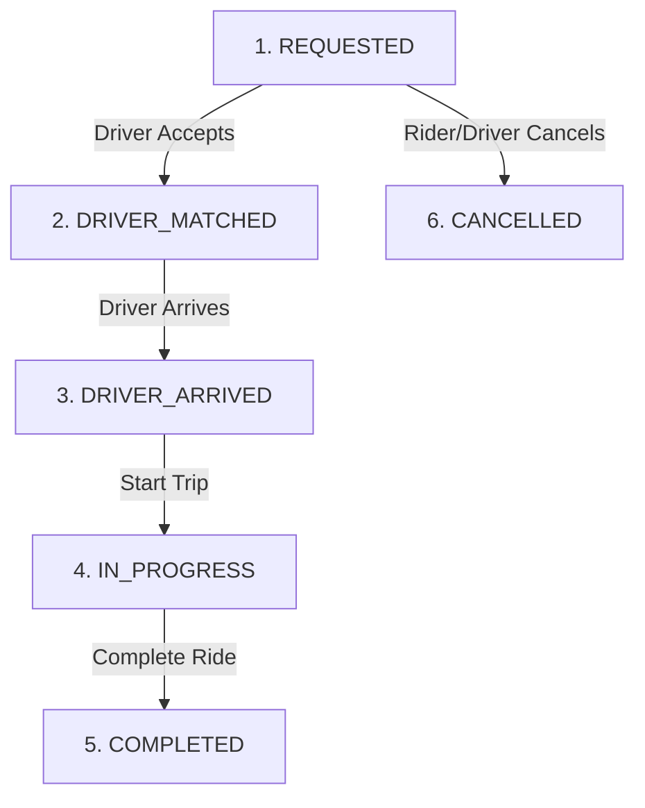
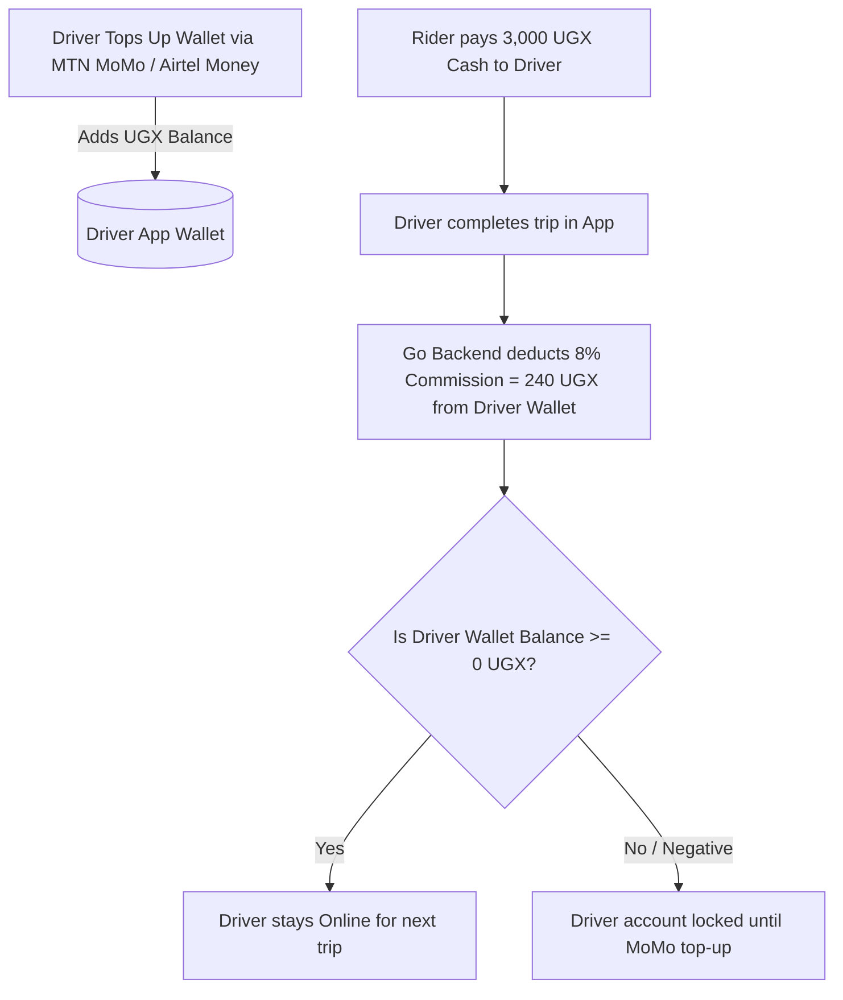

# 📘 SYSTEM BIBLE: Ugandan Cash-First Ride-Sharing Platform

A production-ready architectural blueprint, domain model specification, and technical system bible for an ultra-low-latency, cash-native ride-sharing platform optimized for the Ugandan market (Kampala & regional hubs), benchmarked directly against real SafeBoda and FARAS trip data.

---

## 🎯 Executive Overview & Strategic Vision

### 1. Reverse-Engineered Competitor Benchmark (SafeBoda vs. FARAS vs. Us)
Based on live telemetry & receipts on the exact same **4.2 km route** (Ripple Effect Uganda ➔ Komamboga, Kampala):

| Feature / Metric | SafeBoda (Receipt Data) | FARAS (Receipt Data) 🏆 | Our Platform Target 🎯 |
| :--- | :--- | :--- | :--- |
| **Standard 4.2km Fare** | `UGX 3,600` – `UGX 3,900` | **`UGX 3,000`** (Flat rate) | **`UGX 2,800` – `UGX 3,000`** |
| **Promo Fare** | None | **`UGX 2,500`** (-500 Promo) | **`UGX 2,500`** (-500 Promo) |
| **Pricing Model** | Complex sub-items + `1,009 UGX` Long Ride Penalty | Clean 500 / 1,000 UGX step pricing | Clean 500 / 1,000 UGX step pricing |
| **Driver Commission** | **15%** (Driver gets `3,060` of 3,600) | **15%** (Driver gets `2,550` of 3,000) | **8%** (Driver gets `2,760` of 3,000) |
| **Driver Net Payout** | `3,060 UGX` | `2,550 UGX` | **`2,760 UGX` (+210 UGX more than FARAS!)** |
| **Referral Engine** | Standard | `1,500 UGX` Referrer / `5,000 UGX` Friend | `1,500 UGX` Referrer / `3,000 UGX` Friend |

---

### 2. Key Insights Discovered from Live Market Data

#### 💡 Insight A: FARAS is Beating SafeBoda on Flat, Clean Pricing
* SafeBoda charges **`3,600 – 3,900 UGX`** for 4.2km due to complex line items and hidden long-ride surcharges.
* FARAS charges a flat, clean **`3,000.00 UGX`** (and **`2,500 UGX`** during promotions), making FARAS **17% to 36% cheaper** than SafeBoda!

#### 💡 Insight B: How We Beat BOTH Competitors Simultaneously
By charging **`3,000 UGX`** (matching FARAS for riders) but taking only **8% commission**:
* **FARAS Driver** earns `2,550 UGX` on a 3,000 UGX ride.
* **Our Driver** earns **`2,760 UGX`** on the exact same 3,000 UGX ride!
* **Result**: Riders get the cheapest market price (`3,000 UGX`), while drivers earn **+210 UGX more per ride** on our platform!

---

## 🏗️ System Architecture & Technology Stack

```text
[ Rider / Driver Mobile Apps ]
        │
        ├── (HTTP / JSON REST) ──────────► [ Chi Router / Go Backend ]
        └── (WebSockets / Realtime GPS) ──► [ Gorilla WebSockets ]
                                                   │
                                     ┌─────────────┴─────────────┐
                                     ▼                           ▼
                           [ Redis (GEO Cache) ]       [ PostgreSQL + PostGIS ]
                           (Live Driver GPS Tracking)   (ACID Trips & Wallets)
```

| Layer | Technology | Purpose & Rationale |
| :--- | :--- | :--- |
| **Language** | **Go 1.25** | Sub-millisecond latency, concurrency (`goroutines`), <10 MB RAM footprint. |
| **HTTP Router** | **`Chi` (`go-chi/chi/v5`)** | 100% `net/http` compatible, zero allocations, clean middleware groups (`r.Group(...)`). |
| **Database & ORM** | **PostgreSQL + PostGIS + `sqlc`** | Spatial queries (`ST_DWithin`) with compile-time type-safe Go code generation. |
| **Realtime Cache** | **Redis (GEO Commands)** | Drivers stream GPS locations every 3s. `GEOADD` and `GEORADIUS` match drivers in <2ms. |
| **Mobile Money** | **MTN MoMo & Airtel Money** | Driver prepaid wallet top-ups via direct API integration or Flutterwave/Beyonic aggregators. |
| **Containerization** | **Multi-stage `scratch` Docker** | 5.7 MB static binary image, 0 OS CVEs, running under non-root `nobody` (UID 65534). |

---

## 📁 Package-by-Feature Project Structure

```text
ride-share-uganda/
├── cmd/
│   └── api/
│       └── main.go                 # App entrypoint: loads config, boots DB, runs Chi server
├── internal/                       # Compiler-enforced private application code
│   ├── config/
│   │   └── config.go               # Environment parser (PORT, DATABASE_URL, MOMO_KEYS)
│   ├── db/
│   │   ├── migrations/             # Sequential Goose PostGIS SQL migration files
│   │   │   ├── 00001_create_users_table.sql
│   │   │   ├── 00002_create_postgis_trips.sql
│   │   │   ├── 00003_create_wallets_table.sql
│   │   │   └── 00004_create_promotions_table.sql
│   │   ├── queries/                # Raw SQL query definitions for sqlc
│   │   │   ├── users.sql
│   │   │   ├── trips.sql
│   │   │   ├── wallets.sql
│   │   │   └── promos.sql
│   │   └── db.go                   # PostGIS connection pool & migration runner
│   ├── location/                   # Real-time WebSocket GPS streaming & Redis GEO index
│   │   ├── handler.go              # WS handler (/ws/driver/location)
│   │   └── redis_geo.go            # GEOADD / GEORADIUS query engine
│   ├── trip/                       # Trip State Machine & Driver Matchmaker
│   │   ├── handler.go              # REST trip endpoints (/api/trips/request)
│   │   ├── service.go              # Dispatch logic to nearest driver
│   │   └── state.go                # Trip State Machine logic
│   ├── pricing/                    # Reverse-engineered SafeBoda & FARAS pricing engine
│   │   └── uganda.go
│   ├── promo/                      # Referral & Discount Promo Engine (1,500 UGX referral)
│   │   └── service.go
│   ├── wallet/                     # MTN MoMo & Airtel Money driver wallet top-ups
│   │   ├── service.go
│   │   └── momo.go                 # MoMo API integration
│   ├── middleware/
│   │   └── auth.go                 # Session token & Bearer auth middleware
│   └── models/
│       └── models.go               # Shared domain structs & API response envelopes
├── .env                            # Active local environment config
├── .env.example                    # Environment variable template
├── Dockerfile                      # Active production Dockerfile (scratch base)
├── Makefile                        # Dev automation (make run, make test, make generate)
├── sqlc.yaml                       # sqlc code generator manifest
├── go.mod                          # Go module definition
└── README.md                       # High-level overview
```

---

## 💰 Ugandan Market Pricing Engine (`internal/pricing/uganda.go`)

### Go Code Implementation:

```go
package pricing

import (
	"math"
)

type MarketRates struct {
	BaseFare       float64 // 1,000 UGX
	PerKmRate      float64 // 450 UGX / km
	PerMinuteRate  float64 // 30 UGX / min
	MinimumFare    float64 // 2,000 UGX
	CommissionPct  float64 // 0.08 (8% vs 15% SafeBoda/FARAS)
}

type TripPricingBreakdown struct {
	BaseFare       int64 `json:"base_fare"`
	DistanceCost   int64 `json:"distance_cost"`
	DurationCost   int64 `json:"duration_cost"`
	PromoDiscount  int64 `json:"promo_discount_ugx"`
	Subtotal       int64 `json:"subtotal"`
	FinalCostUGX   int64 `json:"final_cost_ugx"`
	DriverEarnings int64 `json:"driver_earnings_ugx"`
	PlatformFee    int64 `json:"platform_fee_ugx"`
}

// CalculateUgandaFare calculates competitive clean fares with 500 UGX rounding
func CalculateUgandaFare(distanceKm, durationMins, promoDiscount float64, rates MarketRates) TripPricingBreakdown {
	distCost := distanceKm * rates.PerKmRate
	durCost := durationMins * rates.PerMinuteRate
	rawSubtotal := rates.BaseFare + distCost + durCost

	if rawSubtotal < rates.MinimumFare {
		rawSubtotal = rates.MinimumFare
	}

	// Clean 500 UGX Step Rounding (e.g. 2,850 -> 3,000 UGX)
	subtotalRounded := int64(math.Round(rawSubtotal/500.0) * 500.0)

	finalCost := subtotalRounded - int64(promoDiscount)
	if finalCost < 1000 {
		finalCost = 1000
	}

	// Ultra-low 8% Commission
	platformFee := int64(float64(finalCost) * rates.CommissionPct)
	driverEarnings := finalCost - platformFee

	return TripPricingBreakdown{
		BaseFare:       int64(rates.BaseFare),
		DistanceCost:   int64(distCost),
		DurationCost:   int64(durCost),
		PromoDiscount:  int64(promoDiscount),
		Subtotal:       subtotalRounded,
		FinalCostUGX:   finalCost,
		DriverEarnings: driverEarnings,
		PlatformFee:    platformFee,
	}
}
```

---

## ⚡️ End-to-End Operational Workflow

### Step 1: Rider Requests a Ride (Upfront Low Price)
1. Rider inputs pickup (**Semawata Rd**) and dropoff (**Komamboga**).
2. Go Pricing Engine computes distance (`4.2km`), duration (`11 mins`), and calculates upfront fare (**`3,000 UGX`** or **`2,500 UGX`** with promo).
3. Rider sees: **"Upfront Cash Fare: 3,000 UGX"** and taps Request.

### Step 2: Instant Driver Matching (Redis GEO <2ms)
1. Go backend executes Redis query: `GEORADIUS drivers:available <pickup_lng> <pickup_lat> 3 km`.
2. Finds closest driver (e.g., Timothy on his Boda 500m away).
3. Sends WebSocket notification to driver: *"New Trip: Semawata Rd ➔ Komamboga (Fare: 3,000 UGX, Net: 2,760 UGX)"*.

### Step 3: Realtime GPS Streaming (WebSockets)
1. Driver accepts. Trip state becomes `DRIVER_MATCHED`.
2. Driver phone sends GPS updates every 3s over WebSockets to update live map.
3. Driver arrives ➔ Taps **"Arrived"** (`DRIVER_ARRIVED`).

### Step 4: Dropoff & Cash Payment (Digital Change Wallet)
1. Driver completes trip (`COMPLETED`). Screen displays: **"Pay Driver: 3,000 UGX Cash"**.
2. Rider pays `5,000 UGX` note. Driver returns `2,000 UGX` note.
3. *(If driver lacks 500 UGX change, driver taps "Credit 500 UGX Change", which credits 500 UGX to rider's app wallet for their next trip).*

### Step 5: Automated 8% Commission Settlement
1. Driver taps **"Confirm Cash Received (3,000 UGX)"**.
2. Go backend automatically deducts 8% commission (**`240 UGX`**) from driver's prepaid MTN/Airtel MoMo wallet.
3. Driver keeps **`2,760 UGX` net cash profit** (+210 UGX more than FARAS) and returns `ONLINE`.

---

## 🎁 Referral & Promo Engine (`internal/promo/service.go`)

Based on FARAS's viral growth mechanics (`"Get 1500 UGX when a friend takes their first trip"`):

```sql
-- 00004_create_promotions_table.sql
CREATE TABLE IF NOT EXISTS referral_codes (
    id BIGSERIAL PRIMARY KEY,
    user_id BIGINT NOT NULL REFERENCES users(id),
    code VARCHAR(20) NOT NULL UNIQUE,
    created_at TIMESTAMPTZ DEFAULT CURRENT_TIMESTAMP
);

CREATE TABLE IF NOT EXISTS user_promos (
    id BIGSERIAL PRIMARY KEY,
    user_id BIGINT NOT NULL REFERENCES users(id),
    amount_ugx BIGINT NOT NULL DEFAULT 500,
    is_used BOOLEAN DEFAULT FALSE,
    expires_at TIMESTAMPTZ NOT NULL
);
```

---

## 🔄 Trip State Machine Specification



---

## 💳 Driver Mobile Money Wallet Architecture


